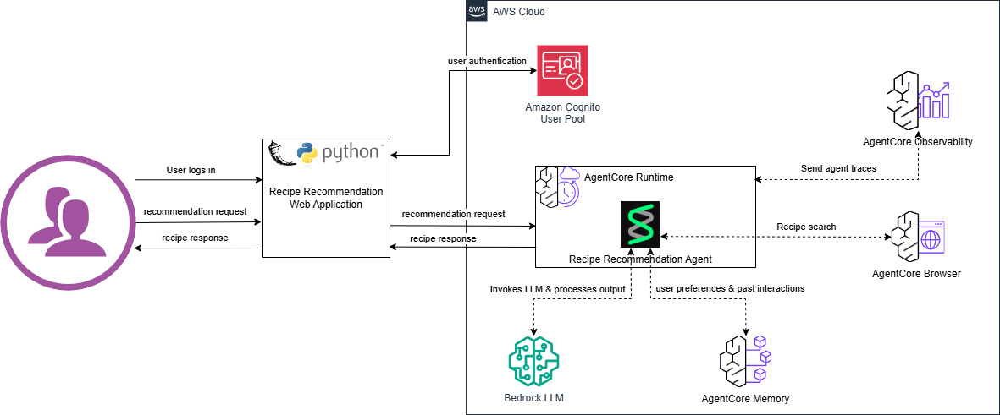

# Recipe Recommendation Agent
Agentic AI solution for recipe recommendations. It maintains user's dietary preferences, remembers previous meal history and provides relevant recommendations.

## Architecture
Application architecture 
The web app integrates Cognito authentication with the existing agent invocation:
- User authentication via AWS Cognito User Pool
- User starts chat session
- User provides ingredients, what they would like to cook and sends the request to RecipeRecommendationAgent
- RecipeRecommendationAgent running within Bedrock AgentCore using user-specific tokens
- RecipeRecommendationAgent searches user preferences from AgentCore Memory
- RecipeRecommendationAgent searches for relevant recipies using AgentCore Browser tool
- RecipeRecommendationAgent prepared response from tool use and sends response back to the user.

## Project Structure
- recipe_recommendation         
  - architecture
  - recipeRecommentationAgent   
    - Readme.md
  - recipeRecommentationWeb
    - Readme.md